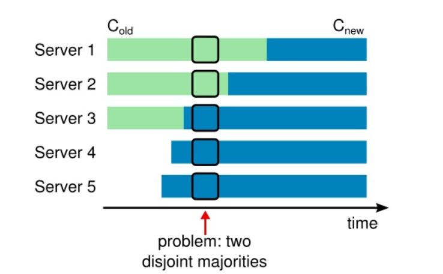
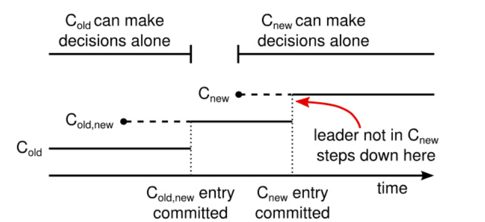
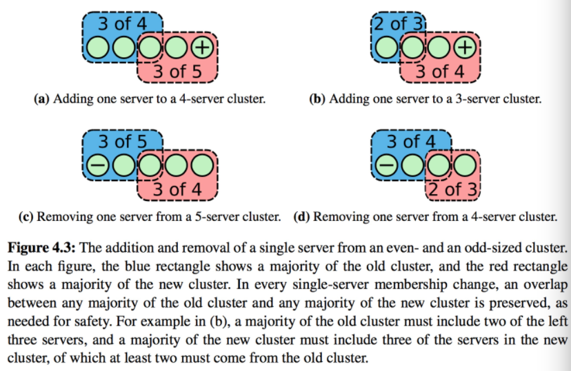

# Raft

Raft 通过选举一个高贵的领导人，然后给予他全部的管理复制日志的责任来实现一致性。领导人从客户端接收日志条目，把日志条目复制到其他服务器上，并且当保证安全性的时候告诉其他的服务器应用日志条目到他们的状态机中。

通过领导人的方式，Raft 将一致性问题分解成了三个相对独立的子问题以及两个附加问题，这些问题会在接下来的子章节中进行讨论：

- **领导选举**：一个新的领导人需要被选举出来，当现存的领导人宕机的时候
- **日志复制**：领导人必须从客户端接收日志然后复制到集群中的其他节点，并且强制要求其他节点的日志保持和自己相同。
- **安全性**：在 Raft 中安全性的关键是状态机安全：如果有任何的服务器节点已经应用了一个确定的日志条目到它的状态机中，那么其他服务器节点不能在同一个日志索引位置应用一个不同的指令。
- **集群成员变更** ：增加或者减少集群节点
- **日志压缩** ：生成快照，删除旧日志，减少日志的储存空间。

## 领导选举
### Timeout
1. In Raft there are two timeout settings which control elections.
2. election timeout：The election timeout is the amount of time a follower waits until becoming a candidate.（一般150ms - 300ms），After the election timeout the follower becomes a candidate and starts a new election term
3. heartbeat timeout：The leader begins sending out Append Entries messages to its followers.These messages are sent in intervals specified by the heartbeat timeout.The follower reset election timeout when receive heartbeat
4. election timeout >> heartbeat timeout

### 启动之后
1. 当服务器程序启动时，他们都是跟随者身份
2. 领导者周期性的向所有跟随者发送心跳包，一个服务器节点继续保持着跟随者状态只要他从领导人或者候选者处接收到有效的 RPCs
3. 如果一个跟随者在一段时间里没有接收到任何消息，也就是**选举超时**（ election timeout），则发起选举以选出新的领导者

### 进行领导选举
1. 跟随者先要增加自己的当前任期号并且转换到候选人状态
2. 然后他会投票给自己，然后并行的向集群中的其他服务器节点发送请求投票的 RPCs 来给自己投票
3. 候选人会继续保持着当前状态直到以下三件事情之一发生：(a) 他自己赢得了这次的选举；(b) 其他的服务器成为领导者；(c) 一段时间之后没有任何一个获胜的人

### 领导选举结果
1. 当一个候选人从整个集群的大多数服务器节点获得了针对同一个任期号的选票，那么他就赢得了这次选举并成为领导人。然后他会向其他的服务器发送心跳消息来建立自己的权威并且阻止新的领导人的产生。
2. 在等待投票的时候，候选人可能会从其他的服务器接收到声明它是领导人的附加日志项 RPC。如果这个领导人的任期号（包含在此次的 RPC中）不小于候选人当前的任期号，那么候选人会承认领导人合法并回到跟随者状态。 如果此次 RPC 中的任期号比自己小，那么候选人就会拒绝这次的 RPC 并且继续保持候选人状态。
3. 如果有多个跟随者同时成为候选人，那么选票可能会被瓜分以至于没有候选人可以赢得大多数人的支持。当这种情况发生的时候，每一个候选人都会超时（ election timeout），然后通过增加当前任期号来开始一轮新的选举。

### 领导选举限制
1. 一个节点在一次任期内只能投一次票
2. 请求投票RPC 中包含了候选人的日志信息，然后投票人会拒绝掉那些日志没有自己新的投票请求。

## 日志复制（心跳）
### 概述
1. 日志复制：一旦一个领导人被选举出来，他就开始为客户端提供服务。客户端的每一个请求都包含一条被复制状态机执行的指令。领导人把这条指令作为一条新的日志条目附加到日志中去，然后利用心跳（附加条目 RPCs ）发送给给其他的服务器，让他们复制这条日志条目。当这条日志条目被安全的复制（下面会介绍），领导人会应用这条日志条目到它的状态机中然后把执行的结果返回给客户端。如果跟随者崩溃或者运行缓慢，再或者网络丢包，领导人会不断的重复尝试心跳（附加日志条目 RPCs ）（尽管已经回复了客户端）直到所有的跟随者都最终存储了所有的日志条目。
2. 心跳： 一旦一个领导人被选举出来，他会在以固定时间间隔发送心跳（附加条目 RPCs ）给其他服务器。心跳有两个作用：1.确立以及维护领导者地位，避免其他节点选举超时。2.发送领导者日志，使跟随者复制日志，当大多数节点都成功复制日志时，则提交日志。

### 日志复制的特性
1. 如果在不同节点的日志中的两个条目拥有相同的索引和任期号，那么他们存储了相同的指令。
2. 如果在不同节点的日志中的两个条目拥有相同的索引和任期号，那么他们之前的所有日志条目也全部相同。

### 领导者行为
1. 领导人针对每一个跟随者维护了一个 nextIndex，这表示下一个需要发送给跟随者的日志条目的索引地址。当一个领导人刚获得权力的时候，他初始化所有的 nextIndex 值为自己的最后一条日志的 index 加 1
2. 如果一个跟随者的日志和领导人不一致，那么在下一次的附加日志 RPC 时的一致性检查就会失败。在被跟随者拒绝之后，领导人就会减小 nextIndex 值并进行重试。
3. 最终 nextIndex 会在某个位置使得领导人和跟随者的日志达成一致，领导人和跟随者具有的相同日志条目的最大索引为matchIndex。
4. 如果对于大多数节点，matchIndex >= N，而且matchIndex处的日志条目的term == currentTerm（安全性保证），则领导者更新commitIndex = N。

### 跟随者行为
1. 返回假 如果领导者的任期 小于 接收者的当前任期
2. 如果还没有设置leader，则根据request里的leaderId确定leader节点
3. 返回假 如果接收者日志中没有包含这样一个条目 即该条目的任期在preLogIndex上能和prevLogTerm匹配上 
4. 如果preLogIndex上能和prevLogTerm匹配上，那么就删除其之后的所有条目
5. 追加日志中尚未存在的任何新条目
6. 如果领导者的已知已经提交的最高的日志条目的索引 大于 接收者的已知已经提交的最高的日志条目的索引 则把 接收者的已知已经提交的最高的日志条目的索引 重置为 领导者的已知已经提交的最高的日志条目的索引 或者是 上一个新条目的索引 取两者的最小值

## 集群成员变化

### 集群成员变化的问题
直接从一种配置转到新的配置是十分不安全的，因为各个机器可能在任何的时候进行转换。
在这个例子中，集群配额从 3 台机器变成了 5 台。不幸的是，存在这样的一个时间点，
两个不同的领导人在同一个任期里都可以被选举成功。一个是通过旧的配置：server1和server2选举server1成为leader（三台机器中的的两台）；
一个通过新的配置：server3、server4和server5选举server3成为leader（五台机器中的三台）。

### 解决方法：两阶段方法、共同一致
1. 集群配置在复制日志中以特殊的日志条目来存储和通信
2. 当一个领导人接收到一个改变配置从 C-old 到 C-new 的请求，他会生成一个共同一致存储配置日志C-old,new（The joint consensus combines both the old and new configuration， 达成一致（针对选举和提交）需要分别在两种配置上获得大多数的支持。）。
3. 一旦一个服务器将新的配置日志条目增加到它的日志中，他就会用这个配置来做出未来所有的决定（服务器总是使用最新的配置，无论他是否已经被提交）。
4. 一旦 C-old,new 被提交， 领导人创建一条关于 C-new 配置的日志条目并复制给集群就是安全的了。

#### 共同一致解决方法的分析：
整个集群的变更分为几个过渡期，就如下图所示，在每一个时期，每一个任期下都不可能出现两个Leader：

1. Cold,new日志在提交之前，在这个阶段，Cold,new中的所有节点有可能处于Cold的配置下，也有可能处于Cold,new的配置下，如果这个时候原Leader宕机了，无论是发起新一轮投票的节点当前的配置是Cold还是Cold,new，都需要Cold的节点同意投票，所以不会出现两个Leader
2. Cold,new提交之后，Cnew下发之前，此时所有Cold,new的配置已经在Cold和Cnew的大多数节点上，如果集群中的节点超时，那么肯定只有有Cold,new配置的节点才能成为Leader，所以不会出现两个Leader
3. Cnew下发以后，Cnew提交之前，此时集群中的节点可能有三种，Cold的节点（可能一直没有收到请求）， Cold,new的节点，Cnew的节点，其中Cold的节点因为没有最新的日志的，集群中的大多数节点是不会给他投票的，剩下的持有Cnew和Cold,new的节点，无论是谁发起选举，都需要Cnew同意，那么也是不会出现两个Leader
4. Cnew提交之后，这个时候集群处于Cnew配置下运行，只有Cnew的节点才可以成为Leader，这个时候就可以开始下一轮的成员变更了

参考：https://segmentfault.com/a/1190000022796386

### 本项目优化解决方法
1. 单节点成员变更：每次只向集群中添加或移除一个节点。这样能够保证任何时刻，都不可能出现两个不相交的majority，所以，可以从旧成员组直接切到新成员组。

2. 成员组切换时机为apply成员变更日志时：raft论文中，切换的时机是把成员变更日志写盘的时候，不管是否commit。这个切换时机带来的问题是如果这条成员变更日志最终没有commit，在发生leader切换的时候，成员组就需要回滚到旧的成员组。

参考：https://www.cnblogs.com/foxmailed/p/7190642.html

### 集群成员变更之后带来的问题：
1. 新的服务器可能初始化没有存储任何的日志条目。当这些服务器以这种状态加入到集群中，那么他们需要一段时间来更新追赶，这时还不能提交新的日志条目。为了避免这种可用性的间隔时间，Raft 在配置更新之前使用了一种额外的阶段，在这个阶段，新的服务器以没有投票权身份加入到集群中来（领导人复制日志给他们，但是不考虑他们是大多数）。一旦新的服务器追赶上了集群中的其他机器，重新配置可以像上面描述的一样处理。（本项目没有实现）
2. 集群的领导人可能不是新配置的一员。在这种情况下，领导人就会在提交了 C-new 日志之后退位（回到跟随者状态）
3. 移除不在 C-new 中的服务器可能会扰乱集群。这些服务器将不会再接收到心跳，所以当选举超时，他们就会进行新的选举过程。他们会发送拥有新的任期号的请求投票 RPCs，这样会导致当前的领导人回退成跟随者状态。本项目的解决方法是：1. 如果接收到的Rpc请求不来自集群内部节点，则不进行处理。2. 当服务器确认当前领导人存在时，服务器会忽略请求投票 RPCs

## 日志压缩（快照）
### 生成快照
每个服务器独立的创建快照，只包括已经被提交的日志。主要的工作包括将状态机的状态写入到快照中。Raft 也包含一些少量的元数据到快照中：最后被包含索引指的是被快照取代的最后的条目在日志中的索引值（状态机最后应用的日志），最后被包含的任期指的是该条目的任期号。保留这些数据是为了支持快照后紧接着的第一个条目的附加日志请求时的一致性检查，因为这个条目需要前一日志条目的索引值和任期号。为了支持集群成员更新，快照中也将最后的一次配置作为最后一个条目存下来。一旦服务器完成一次快照，他就可以删除最后索引位置之前的所有日志和快照了。

### 安装快照
领导人必须偶尔的发送快照给一些落后的跟随者。这通常发生在当领导人已经将下一条需要发送给跟随者的日志条目删除，储存在快照中。由领导人调用以将快照的分块发送给跟随者。领导者总是按顺序发送分块。

## 实现细节可参考源代码